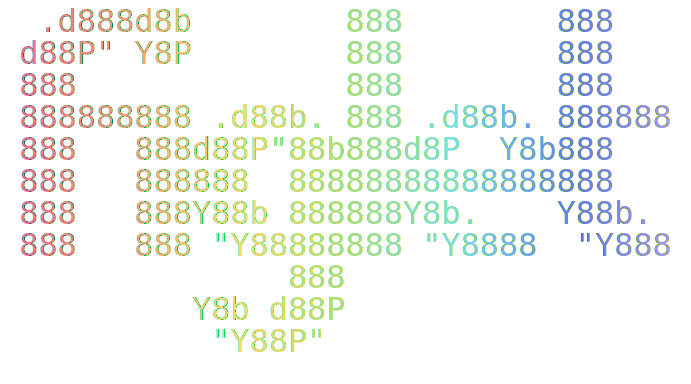

# Figlet Generator

        

<p align="center">
  
</p>

Generate and display ASCII art text using Figlet fonts in Obsidian. Create beautifully styled ASCII art with 280+ fonts, gradient colors, and flexible sizing options.

**Author:** saltyfireball

## Features

### Interactive Modal Command

Insert ASCII art directly into your notes with an interactive modal dialog. Select from 280+ Figlet fonts, preview your text in real-time, customize colors, and insert the result into your editor.

**Command:** "Insert Figlet ASCII Art"

### Code Block Support

Embed ASCII art directly in your notes using code blocks with YAML-style configuration.

````
```sfb-figlet
font: Banner
color: #5C7CFA
---
Hello World
````

````

### Cross-Plugin API

Extend the plugin's functionality in your own plugins using the `window.figletAPI` interface.

```typescript
const result = await window.figletAPI.generateText('Hello', 'Banner');
const html = window.figletAPI.createHtml('Test', { font: 'Standard', color: '#FF0000' });
````

## Installation

### Manual Installation

1. Download the latest release files
2. Copy to your vault's plugins directory:

    ```
    .obsidian/plugins/figlet-generator/
    ```

3. Required files:
    - `main.js`
    - `manifest.json`
    - `styles.css`
    - `fonts/` directory

4. Reload Obsidian or enable the plugin in Settings > Community Plugins

## Usage

### Modal Command

1. Open the command palette (Ctrl/Cmd + P)
2. Search for "Insert Figlet ASCII Art"
3. Select your font from the dropdown
4. Enter your text in the input field
5. Customize colors and styling options
6. Click "Insert" to add the ASCII art to your note

### Code Blocks

Create a code block with language ID `sfb-figlet` (configurable) and use YAML-style configuration:

````
```sfb-figlet
font: Big
color: #FF6B6B
font-size: 12
line-height: 1.2
centered: true
opacity: 0.8
---
Your Text Here
````

```

#### Code Block Options

| Option | Type | Default | Description |
|--------|------|---------|-------------|
| `font` | string | Standard | Name of the Figlet font to use |
| `color` | string | inherit | Single color in hex format or "rainbow" for gradient |
| `colors` | string | - | Space-separated list of hex colors for custom gradient |
| `font-size` | number | 10 | Font size in pixels |
| `line-height` | number | 1 | Line height multiplier |
| `centered` | boolean | true | Center the output text |
| `opacity` | number | 1 | Text opacity from 0 to 1 |
| `multi-center` | boolean | false | Center each line independently |

#### Color Examples

```

```sfb-figlet
font: Standard
color: #5C7CFA
---
Blue Text
```

```

```

```sfb-figlet
font: Banner
color: rainbow
---
Rainbow Gradient
```

```

```

```sfb-figlet
font: Big
colors: #FF0000 #FFFF00 #00FF00
---
Custom Gradient
```

````

### Cross-Plugin API

Other plugins can use the Figlet Generator API to generate ASCII art programmatically.

#### API Methods

**`generateText(text: string, font?: string): Promise<string>`**

Generate ASCII art text and return it as a string.

```typescript
const figlet = window.figletAPI;
const ascii = await figlet.generateText('Hello', 'Banner');
````

**`createHtml(text: string, options: FigletHtmlOptions): string`**

Generate HTML representation of ASCII art with styling applied.

```typescript
const html = figlet.createHtml("Hello", {
    font: "Standard",
    color: "#FF0000",
    fontSize: 12,
    lineHeight: 1.2,
    centered: true,
    opacity: 0.8,
});
```

#### Default Gradient Colors

Access the default rainbow gradient colors used by the plugin.

```typescript
const colors = window.figletAPI.defaultGradientColors;
console.log(colors); // ['#FF0000', '#FFFF00', '#00FF00', ...]
```

#### FigletHtmlOptions

```typescript
interface FigletHtmlOptions {
    font?: string;
    color?: string;
    colors?: string[];
    fontSize?: number;
    lineHeight?: number;
    centered?: boolean;
    opacity?: number;
    multiCenter?: boolean;
}
```

## Settings

Configure plugin behavior in Settings > Figlet Generator:

- **Code Block Language ID** - Set the language identifier for code blocks (default: `sfb-figlet`)
- **Font Size** - Default font size in pixels (default: 10)
- **Line Height** - Default line height multiplier (default: 1)
- **Center Output** - Center text by default (default: enabled)
- **Gradient Colors** - Colors used for rainbow mode
- **Favorite Fonts** - Manage your favorite fonts for quick access

## Available Fonts

The plugin ships with 280+ display fonts from the Figlet font library, with 413 total font files. Fonts are loaded on-demand to minimize memory usage and automatically unloaded after text generation.

Some popular fonts:

- Standard
- Banner
- Big
- Block
- Bubble
- Digital
- Doom
- Graffiti
- Isometric
- Lean
- Mini
- Shadow
- Slant
- Small
- Smscript
- Smslant
- Speed
- Splash
- Straight
- Term

View the complete font list in the modal font selector.

## Advanced Features

### Gradient Colors

Use the `rainbow` color mode for automatic gradient or specify custom colors:

````
```sfb-figlet
font: Banner
colors: #FF1744 #F57F17 #FBC02D #00BCD4 #3F51B5
---
Multi-Color
````

```

### Opacity and Styling

Adjust the visual appearance with opacity and sizing:

```

```sfb-figlet
font: Big
color: #4CAF50
opacity: 0.7
font-size: 14
line-height: 1.5
---
Styled Text
```

```

### Line-by-Line Centering

Center each line independently instead of the entire block:

```

```sfb-figlet
font: Standard
centered: false
multi-center: true
---
Centered
Lines
```

```

## Performance

- Fonts are loaded on-demand and automatically unloaded after use
- Code blocks are rendered asynchronously to prevent UI blocking
- Efficient HTML generation with minimal DOM manipulation
- Caching of frequently used fonts

## Accessibility

- Semantic HTML structure for ASCII art
- Proper color contrast for readability
- Configurable opacity to reduce visual strain
- Text alternatives available via source view

## Examples

### Banner Title

```

```sfb-figlet
font: Banner
color: #5C7CFA
---
My Notes
```

```

### Section Header

```

```sfb-figlet
font: Lean
color: #4CAF50
centered: true
font-size: 11
---
Introduction
```

```

### Rainbow Accent

```

```sfb-figlet
font: Big
color: rainbow
opacity: 0.9
---
Featured
```

```

## Troubleshooting

### Code Block Not Rendering

- Verify the language ID matches your plugin settings (default: `sfb-figlet`)
- Check that text content is provided after the `---` separator
- Ensure the YAML configuration is valid

### Font Not Found

- Check the font name spelling and capitalization
- Verify the font exists in the font selector modal
- Fall back to "Standard" font if unsure

### Performance Issues

- Reduce font size if rendering is slow
- Limit the number of code blocks per note
- Close the plugin settings modal if not in use

### API Not Available

- Ensure the Figlet Generator plugin is installed and enabled
- Check browser console for errors
- Verify other plugins are loading after Figlet Generator

## Limitations

- Font files are loaded from the plugin directory
- Very large text may affect performance
- Some special characters may not render in all fonts
- Rainbow gradient uses predefined color set (customizable in settings)

## License

MIT

## Support

For bug reports, feature requests, or questions, please refer to the plugin documentation or community forums.
```
