# Figlet Generator

        

<p align="center">
  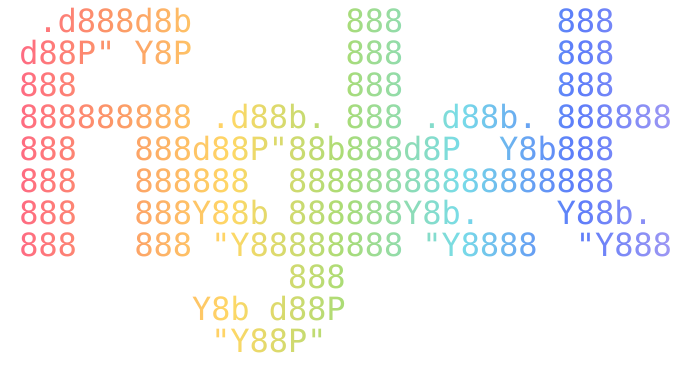
</p>

Generate and display ASCII art text using Figlet fonts in Obsidian: 326 bundled fonts, solid colors, gradients, and sizing options, from a code block or an insert dialog.

**Author:** saltyfireball

<p align="center">
  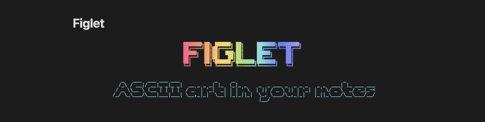
</p>

## Features

### Code blocks that render as ASCII art

Write options on top, a `---` line, then your text. The block re-renders as you edit it.

````
```sfb-figlet
font: Big
color: rainbow
---
Hi there
```
````

<p align="center">
  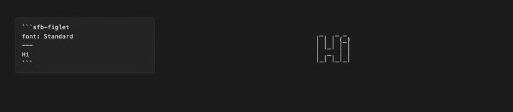
</p>

### 326 fonts

Every font from the Figlet font library ships inside the plugin, so nothing extra needs installing. Font names ignore case: `font: ansi shadow` works.

<p align="center">
  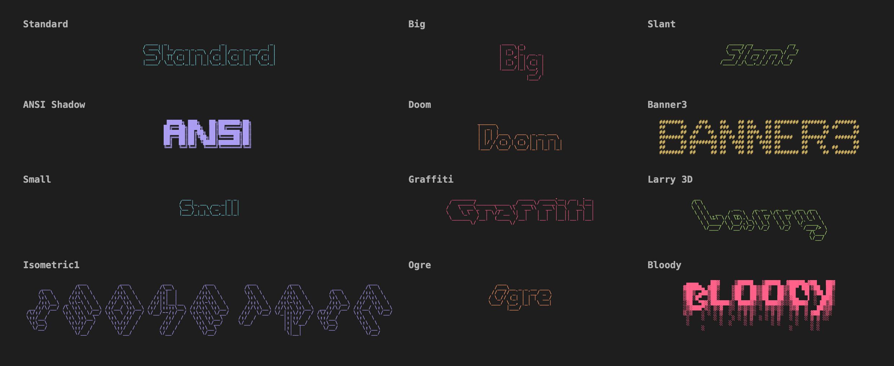
</p>

### Solid colors, gradients and rainbow

One color, a list of colors for a gradient, or `rainbow` for the palette in settings.

<p align="center">
  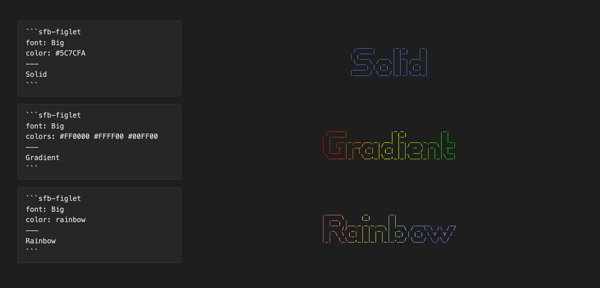
</p>

````
```sfb-figlet
font: Big
colors: #FF0000 #FFFF00 #00FF00
---
Gradient
```
````

### Size, opacity and alignment

<p align="center">
  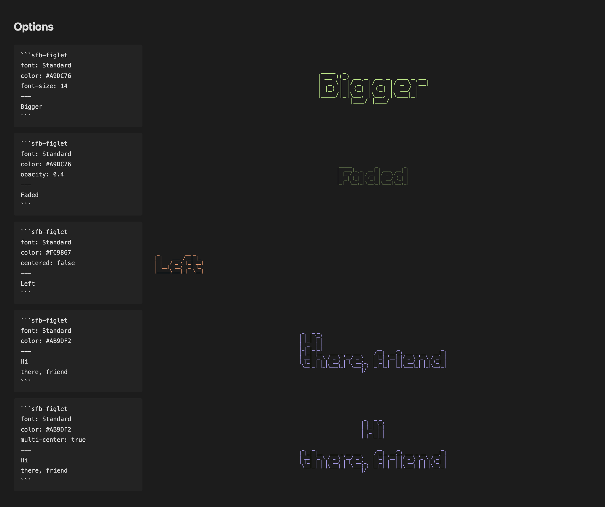
</p>

`multi-center: true` centers each line on its own; without it the lines keep their left edges and the block is centered as a whole.

### Insert dialog

Run **Insert figlet ASCII art** from the command palette to type text, pick a color and font, watch the preview, and insert either an `sfb-figlet` code block or plain HTML.

<p align="center">
  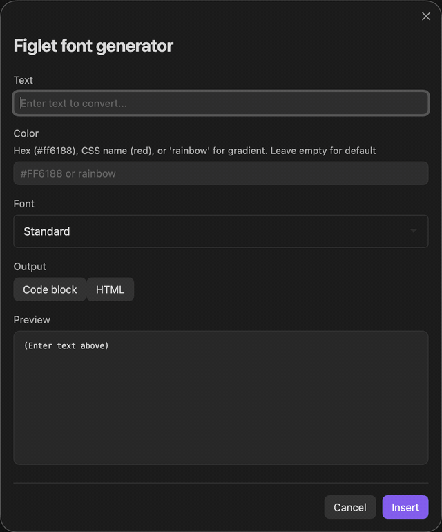
</p>

### Light themes

Colors come from your code block; everything else follows the theme.

<p align="center">
  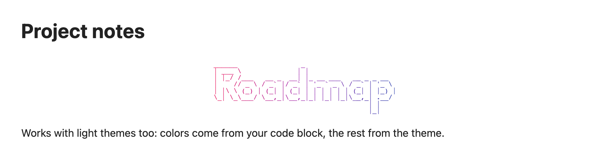
</p>

### Cross-plugin API

Other plugins can generate ASCII art through `window.figletAPI`.

```typescript
const ascii = await window.figletAPI.generateText('Hello', 'Banner');
const html = window.figletAPI.createHtml(ascii, { color: '#FF0000' });
```

## Installation

### Obsidian Community Plugin (pending)

This plugin has been submitted for review to the Obsidian community plugin directory. Once approved, you will be able to install it directly from **Settings > Community plugins > Browse** by searching for "Figlet Generator".

### Using BRAT

You can install this plugin right now using the [BRAT](https://github.com/TfTHacker/obsidian42-brat) plugin:

1. Install BRAT from **Settings > Community plugins > Browse** (search for "BRAT" by TfTHacker)
2. Open the BRAT settings
3. Under the **Beta plugins** section, click **Add beta plugin**

   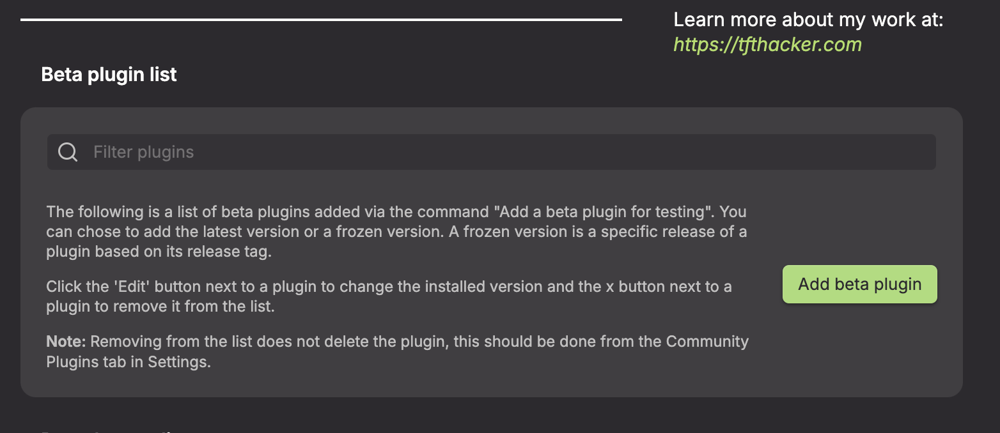

4. In the overlay, enter this plugin's repository: `https://github.com/saltyfireball/obsidian-figlet-generator` (or just `saltyfireball/obsidian-figlet-generator`)

   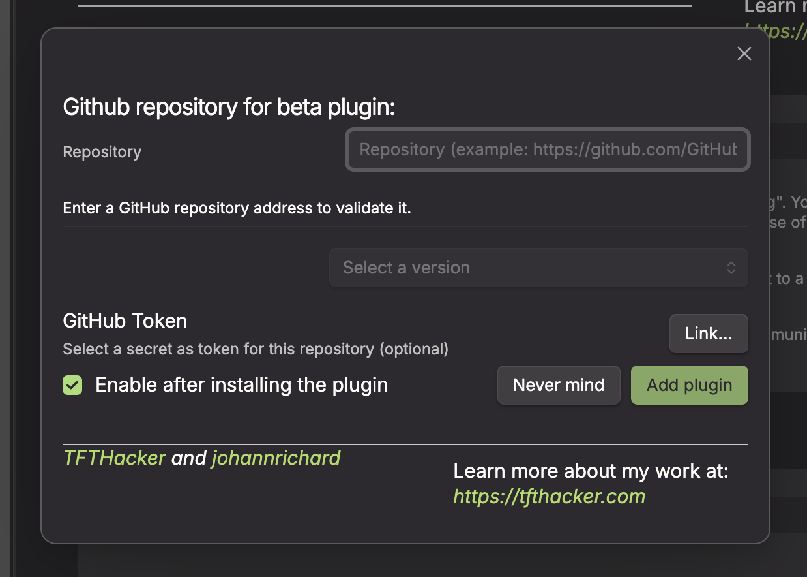

5. Leave the version set to latest

   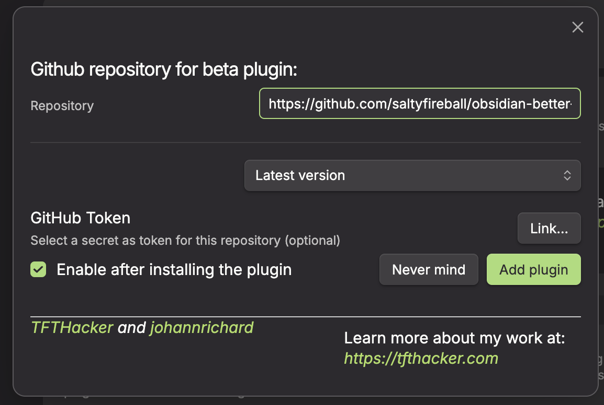

6. Click **Add plugin**

### Manual

1. Download the latest release from the [Releases](https://github.com/saltyfireball/obsidian-figlet-generator/releases) page
2. Copy `main.js`, `manifest.json`, and `styles.css` into your vault's `.obsidian/plugins/figlet-generator/` directory
3. Enable the plugin in **Settings > Community plugins**

## Usage

### Insert dialog

1. Open the command palette (Ctrl/Cmd + P)
2. Search for "Insert figlet ASCII art"
3. Enter your text
4. Optionally set a color (hex, CSS name, or `rainbow`) and pick a font
5. Choose **Code block** or **HTML** output
6. Click **Insert**

### Code blocks

Create a code block with language ID `sfb-figlet` (configurable in settings). Options go above the `---` line, text below it:

````
```sfb-figlet
font: Big
color: #FF6B6B
font-size: 12
line-height: 1.2
centered: true
opacity: 0.8
---
Your Text Here
```
````

#### Code block options

| Option | Type | Default | Description |
|--------|------|---------|-------------|
| `font` | string | Standard | Name of the Figlet font to use (case does not matter) |
| `color` | string | inherit | A single color, several space/comma-separated colors, or `rainbow`/`gradient` for the palette in settings |
| `colors` | string | - | Same as `color`; the two are interchangeable |
| `font-size` | number | 10 | Font size in pixels |
| `line-height` | number | 1 | Line height multiplier |
| `centered` | boolean | true | Center the output |
| `opacity` | number | 1 | Opacity from 0 to 1 |
| `multi-center` | boolean | false | Center each line independently |

`color` and `colors` accept the same values:

| Example | Result |
|---------|--------|
| `color: #5C7CFA` | Single color |
| `color: #FF0000 #FFFF00 #00FF00` | 3-color gradient |
| `color: rainbow` or `color: gradient` | Palette from settings |

#### Examples

````
```sfb-figlet
font: Banner
color: #5C7CFA
---
My Notes
```
````

````
```sfb-figlet
font: Lean
color: #4CAF50
font-size: 11
---
Introduction
```
````

````
```sfb-figlet
font: Slant
color: #FF6188 #FC9867 #FFD866 #A9DC76 #78DCE8
---
Inline Multi-Color
```
````

````
```sfb-figlet
font: Standard
multi-center: true
---
Centered
Lines
```
````

### Cross-plugin API

#### `generateText(text: string, font?: string): Promise<string>`

Returns the ASCII art as plain text.

```typescript
const ascii = await window.figletAPI.generateText('Hello', 'Banner');
```

#### `createHtml(figletText: string, options: FigletHtmlOptions): string`

Wraps ASCII art from `generateText` in styled HTML. The font is chosen in `generateText`; `createHtml` only styles it.

```typescript
const ascii = await window.figletAPI.generateText("Hello", "Standard");
const html = window.figletAPI.createHtml(ascii, {
    color: "#FF0000",
    fontSize: 12,
    lineHeight: 1.2,
    centered: true,
    opacity: 0.8,
});
```

#### `defaultGradientColors`

The plugin's default gradient palette.

```typescript
console.log(window.figletAPI.defaultGradientColors);
// ['#FF6188', '#FC9867', '#FFD866', '#A9DC76', '#78DCE8', '#5C7CFA', '#AB9DF2']
```

#### `FigletHtmlOptions`

```typescript
interface FigletHtmlOptions {
    color?: string;
    colors?: string[]; // two or more for a gradient
    fontSize?: number;
    lineHeight?: number;
    centered?: boolean;
    opacity?: number; // 0 to 1
}
```

## Settings

<p align="center">
  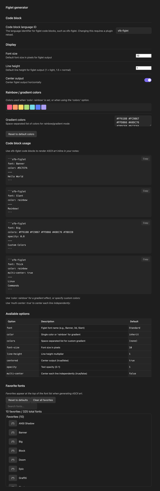
</p>

- **Code block language ID** - The language identifier for code blocks (default: `sfb-figlet`; reload the plugin after changing it)
- **Font size** - Default font size in pixels (default: 10)
- **Line height** - Default line height multiplier (default: 1)
- **Center output** - Center output by default (default: on)
- **Gradient colors** - The palette for `rainbow` and `gradient`
- **Favorite fonts** - Fonts listed first in the insert dialog

## Troubleshooting

### Code block not rendering

- Check that the language ID matches your settings (default: `sfb-figlet`)
- Put your text after the `---` line

### Font not found

- Check the spelling against the font list in the insert dialog or settings
- Use `Standard` if unsure

### API not available

- Make sure Figlet Generator is installed and enabled
- Check the developer console for errors

## Limitations

- Very large text may be slow to render
- Some fonts do not include every character

## About the font data in main.js

Most of `main.js` (about 1.5 MB) is font data, not code. At build time, [`scripts/figlet-fonts-plugin.mjs`](scripts/figlet-fonts-plugin.mjs) reads each font listed in [`src/font-list.json`](src/font-list.json) from the [figlet](https://www.npmjs.com/package/figlet) package's `fonts/` folder, gzips it and embeds it as a base64 string, because the community directory installs only `main.js`, `manifest.json` and `styles.css`. Each string decodes back to the original `.flf` text file when a font is first used, and the tests check that every one matches its source file byte for byte. Nothing in it is executable code.

## Making the README media

The screenshots and GIFs in `assets/media/` come from the real plugin in headless Chromium. See `tools/readme-media/capture.mjs`.

## License

[MIT](LICENSE)
